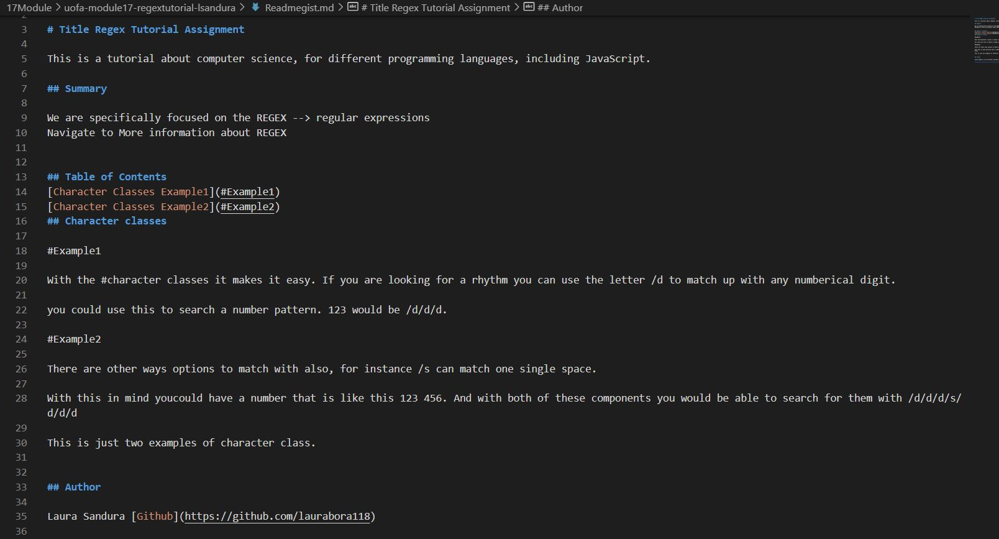

# uofa-module17-regextutorial-lsandura
Computer Science for JavaScript Challenge: Regex Tutorial Bootcamp Module completed by Laura Sandura

Main Objective: 
AS A web development student
I WANT a tutorial explaining a specific regex
SO THAT I can understand the search pattern the regex defines

Challenge: 
GIVEN a regex tutorial
WHEN I open the tutorial
THEN I see a descriptive title and introductory paragraph explaining the purpose of the tutorial, a summary describing the regex featured in the tutorial, a table of contents linking to different sections that break down each component of the regex and explain what it does, and a section about the author with a link to the author’s GitHub profile
WHEN I click on the links in the table of contents
THEN I am taken to the corresponding sections of the tutorial
WHEN I read through each section of the tutorial
THEN I find a detailed explanation of what a specific component of the regex does
WHEN I reach the end of the tutorial
THEN I find a section about the author and a link to the author’s GitHub profile

Additional Expectations:
n/a

Assignment Example 1 Picture:    
    

Git Repository link where finalzed project can be pulled:
    https://github.com/laurabora118/uofa-module17-regextutorial-lsandura  

Git Gist: 
    https://github.com/laurabora118/uofa-module17-regextutorial-lsandura/blob/main/Readmegist.md  

References:
    1 - Assignment criteria received in UofA assignments, starter code provided

    2 - Video lessons in assignment:
        Video: 2.1: Introduction to Regular Expressions - Programming with Text from The Coding Train
        Link: https://www.youtube.com/watch?v=7DG3kCDx53c

    3 - Tutorial from assigment:
        https://coding-boot-camp.github.io/full-stack/computer-science/regex-tutorial

    4 - my own previous code submitted module 5 which was refactored twice from a starter code.
